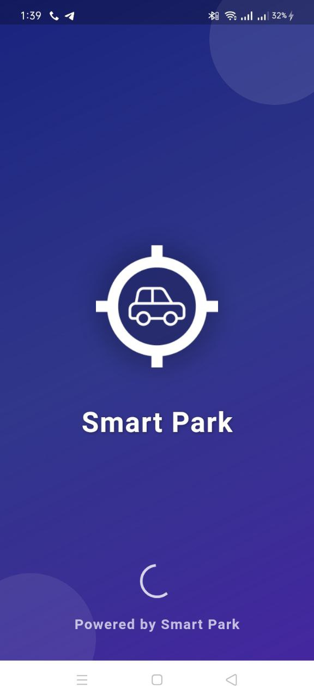
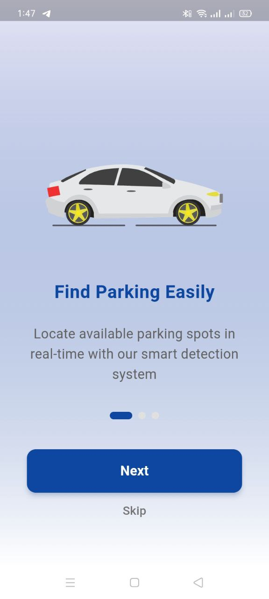
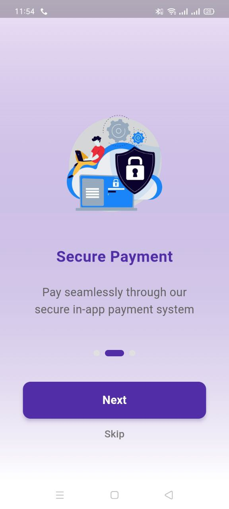
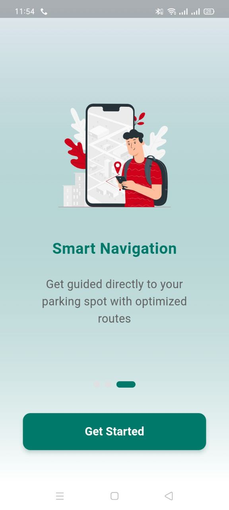
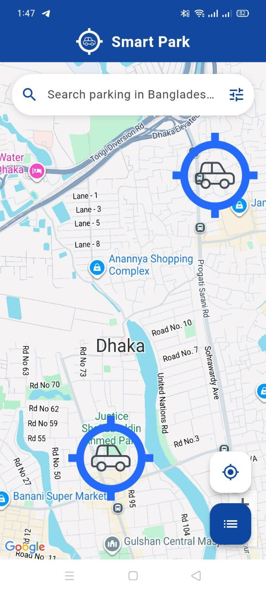
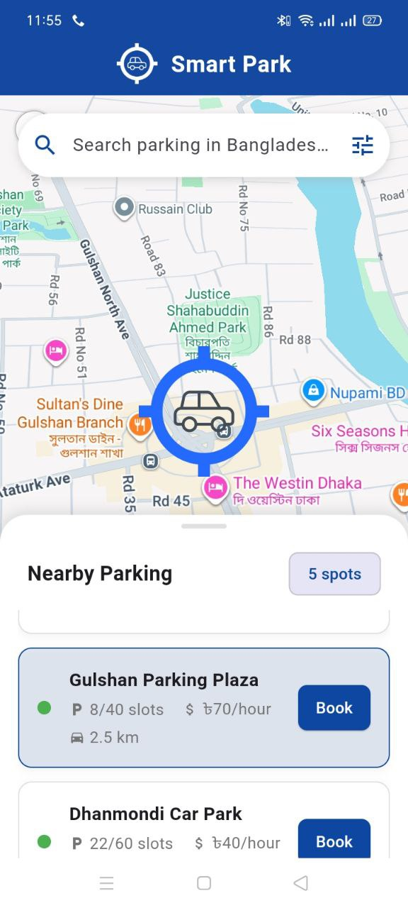
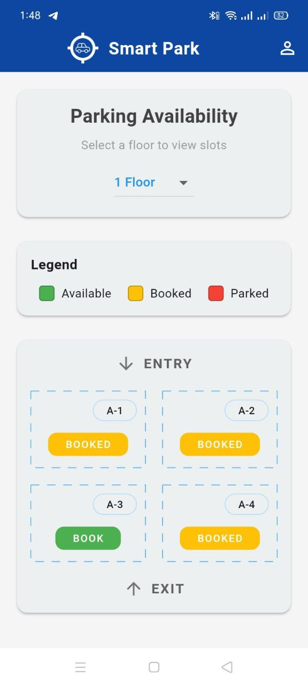
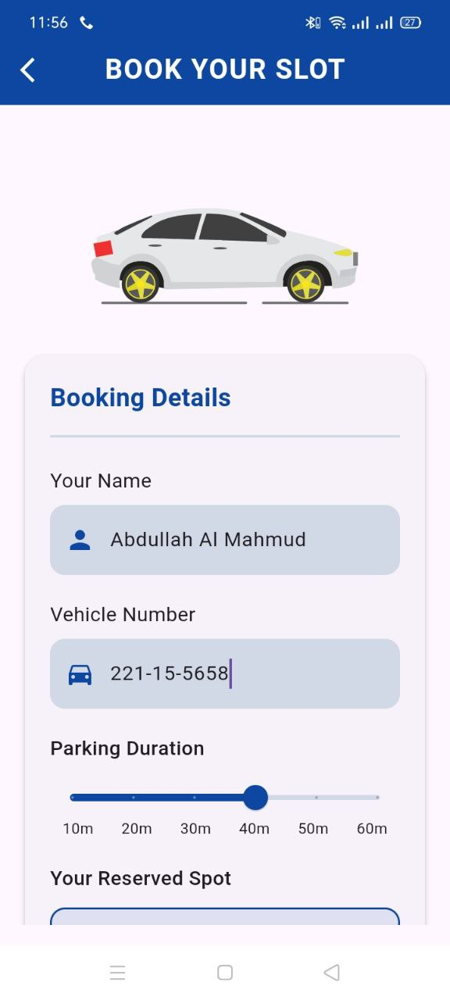
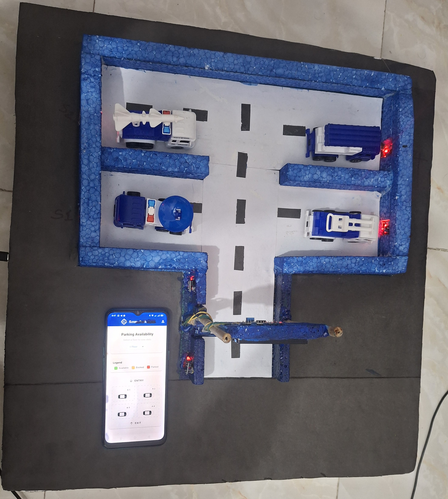

# 🚗 Smart Car Parking System

A comprehensive IoT-based smart parking solution that combines hardware automation with a modern Flutter mobile application for seamless parking management.


## 📱 Screenshots

### App Screenshots
<div align="center">
  
  
  
  
  
  
  
  
</div>

### Hardware Setup
<div align="center">
  
</div>

## 🎯 Features

### Mobile Application
- **🔐 User Authentication** - Secure login and registration system
- **🗺️ Real-time Parking Map** - Interactive Google Maps integration
- **📱 Slot Booking** - Easy parking slot reservation
- **💳 Payment Integration** - Secure payment processing
- **📊 Live Status Updates** - Real-time parking slot availability
- **🎨 Modern UI/UX** - Beautiful animations and smooth interactions
- **📱 Cross-platform** - Works on Android and iOS

### Hardware System
- **🚪 Automated Gate Control** - Servo motor-operated entrance/exit gates
- **📡 IR Sensor Detection** - Vehicle presence detection at entry/exit
- **📊 LCD Display** - Real-time parking status display
- **🔌 IoT Connectivity** - WiFi-enabled ESP32 microcontroller
- **☁️ Cloud Integration** - Firebase real-time database sync
- **🎯 Smart Slot Detection** - Individual parking slot sensors

## 🛠️ Technology Stack

### Frontend (Mobile App)
- **Framework**: Flutter 3.27.3
- **State Management**: GetX
- **Maps**: Google Maps Flutter
- **UI Components**: Material Design 3
- **Animations**: Lottie
- **Icons**: Font Awesome Flutter

### Backend & Cloud
- **Database**: Firebase Firestore
- **Authentication**: Firebase Auth
- **Real-time Updates**: Firebase Realtime Database
- **Hosting**: Firebase Hosting

### Hardware
- **Microcontroller**: ESP32
- **Sensors**: IR sensors for vehicle detection
- **Actuators**: Servo motors for gate control
- **Display**: I2C LCD (16x2)
- **Connectivity**: WiFi module

## 📁 Project Structure

```
smart_car_parking/
├── 📱 lib/                          # Flutter application code
│   ├── components/                  # Reusable UI components
│   ├── config/                      # App configuration
│   ├── controller/                  # Business logic & state management
│   ├── pages/                       # App screens
│   │   ├── onboarding/             # Welcome & splash screens
│   │   ├── homepage/               # Main dashboard
│   │   ├── booking_page/           # Parking booking & payment
│   │   ├── about_us/               # About page
│   │   └── MapPage.dart            # Interactive parking map
│   └── main.dart                   # App entry point
├── 🔧 assets/
│   ├── Arduino/                    # Hardware code
│   │   └── smart_park_hardware.ino # ESP32 Arduino code
│   ├── screens/                    # App screenshots
│   ├── images/                     # App assets
│   ├── animation/                  # Lottie animations
│   └── icons/                      # App icons
├── 🤖 android/                     # Android-specific configuration
├── 🍎 ios/                         # iOS-specific configuration
└── 📄 pubspec.yaml                 # Flutter dependencies
```

## 🚀 Getting Started

### Prerequisites
- Flutter SDK (3.27.3 or higher)
- Android Studio / VS Code
- Arduino IDE
- ESP32 Development Board
- Firebase Project

### Mobile App Setup

1. **Clone the repository**
   ```bash
   git clone https://github.com/yourusername/smart_car_parking.git
   cd smart_car_parking
   ```

2. **Install dependencies**
   ```bash
   flutter pub get
   ```

3. **Configure Firebase**
   - Create a Firebase project
   - Add `google-services.json` to `android/app/`
   - Update Firebase configuration in `lib/firebase_options.dart`

4. **Run the app**
   ```bash
   flutter run
   ```

### Hardware Setup

1. **Components Required**
   - ESP32 Development Board
   - 2x IR Sensors (Entry/Exit detection)
   - 4x IR Sensors (Parking slot detection)
   - 2x Servo Motors (Gate control)
   - I2C LCD Display (16x2)
   - Jumper wires and breadboard

2. **Wiring Diagram**
   ```
   ESP32 Pin Connections:
   - Pin 14: Entry IR Sensor
   - Pin 13: Exit IR Sensor
   - Pin 4,5,26,25: Parking Slot Sensors
   - Pin 27: Gate Servo Motor
   - I2C: LCD Display (SDA: 21, SCL: 22)
   ```

3. **Upload Arduino Code**
   - Open `assets/Arduino/smart_park_hardware.ino` in Arduino IDE
   - Install required libraries:
     - Firebase ESP32 Client
     - LiquidCrystal I2C
     - ESP32Servo
   - Update WiFi credentials and Firebase configuration
   - Upload to ESP32

## 🔧 Configuration

### Firebase Setup
1. Create a new Firebase project
2. Enable Authentication, Firestore, and Realtime Database
3. Add Android app to Firebase project
4. Download `google-services.json` and place in `android/app/`

### WiFi Configuration
Update WiFi credentials in Arduino code:
```cpp
const char* ssid = "your_wifi_name";
const char* password = "your_wifi_password";
```

### Firebase Configuration
Update Firebase settings in Arduino code:
```cpp
#define API_KEY "your_firebase_api_key"
#define DATABASE_URL "your_firebase_database_url"
#define FIREBASE_PROJECT_ID "your_project_id"
```

## 📱 App Features Walkthrough

### 1. Onboarding Experience
- Welcome screens with smooth animations
- Feature introduction
- User registration/login

### 2. Home Dashboard
- Real-time parking availability
- Quick booking options
- Navigation to different sections

### 3. Interactive Parking Map
- Google Maps integration
- Real-time slot status
- Visual parking layout
- Booking directly from map

### 4. Booking System
- Slot selection
- Time-based booking
- Payment integration
- Booking confirmation

### 5. Payment Processing
- Secure payment gateway
- Multiple payment options
- Transaction history

## 🔌 Hardware Features

### Automated Gate Control
- Entry gate opens when slot is available
- Exit gate opens when vehicle approaches
- Automatic gate closure after vehicle passes

### Smart Slot Detection
- Individual sensors for each parking slot
- Real-time availability updates
- Status synchronization with mobile app

### LCD Display
- Shows current parking status
- Displays slot availability
- User-friendly messages

### IoT Connectivity
- WiFi-enabled operation
- Cloud data synchronization
- Remote monitoring capabilities

## 🎨 UI/UX Highlights

- **Material Design 3** - Modern, clean interface
- **Smooth Animations** - Lottie animations for better UX
- **Responsive Design** - Works on all screen sizes
- **Dark/Light Theme** - User preference support
- **Intuitive Navigation** - Easy-to-use interface

## 📊 Data Flow

```
Hardware Sensors → ESP32 → Firebase → Mobile App → User Interface
     ↓              ↓         ↓          ↓           ↓
  IR Detection → Processing → Cloud → Real-time → Display
```

## 🔒 Security Features

- Firebase Authentication
- Secure API communication
- Encrypted data transmission
- User session management

## 📈 Performance Optimizations

- Efficient state management with GetX
- Optimized image assets
- Minimal API calls
- Cached data for offline access

## 🚀 Deployment

### Mobile App
```bash
# Build release APK
flutter build apk --release --no-tree-shake-icons --target-platform android-arm64

# Build for iOS
flutter build ios --release
```

### Hardware
- Upload Arduino code to ESP32
- Connect all sensors and actuators
- Test WiFi connectivity
- Verify Firebase integration

## 🤝 Contributing

1. Fork the repository
2. Create a feature branch (`git checkout -b feature/AmazingFeature`)
3. Commit your changes (`git commit -m 'Add some AmazingFeature'`)
4. Push to the branch (`git push origin feature/AmazingFeature`)
5. Open a Pull Request

## 📄 License

This project is licensed under the MIT License - see the [LICENSE](LICENSE) file for details.

## 👨‍💻 Author

**Mahmud** - *Smart Car Parking System*

## 🙏 Acknowledgments

- Flutter team for the amazing framework
- Firebase for cloud services
- Arduino community for hardware support
- Google Maps for location services

## 📞 Contact

- **Email**: mahmud.cse61@gmail.com
- **Project Link**: [https://github.com/mahmud5658/smart_park](https://github.com/mahmud5658/smart_park)

---

<div align="center">
  <p>Made with ❤️ for smart parking solutions</p>
  <p>⭐ Star this repository if you find it helpful!</p>
</div>
